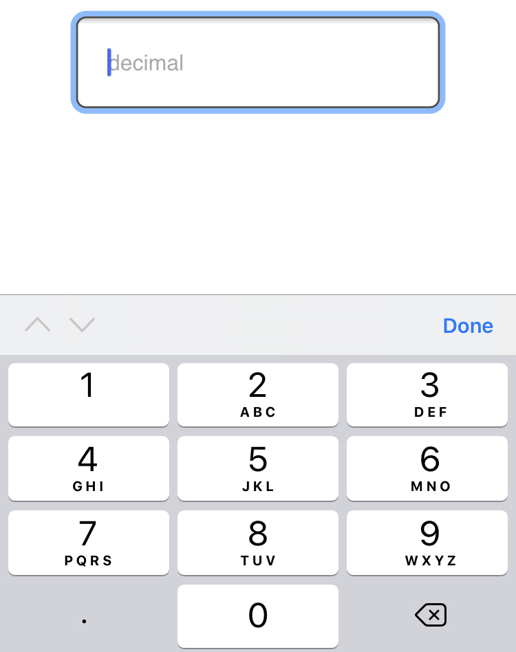
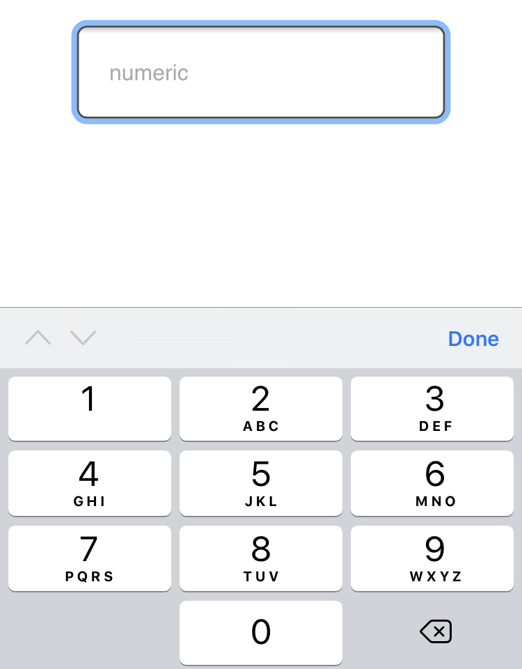
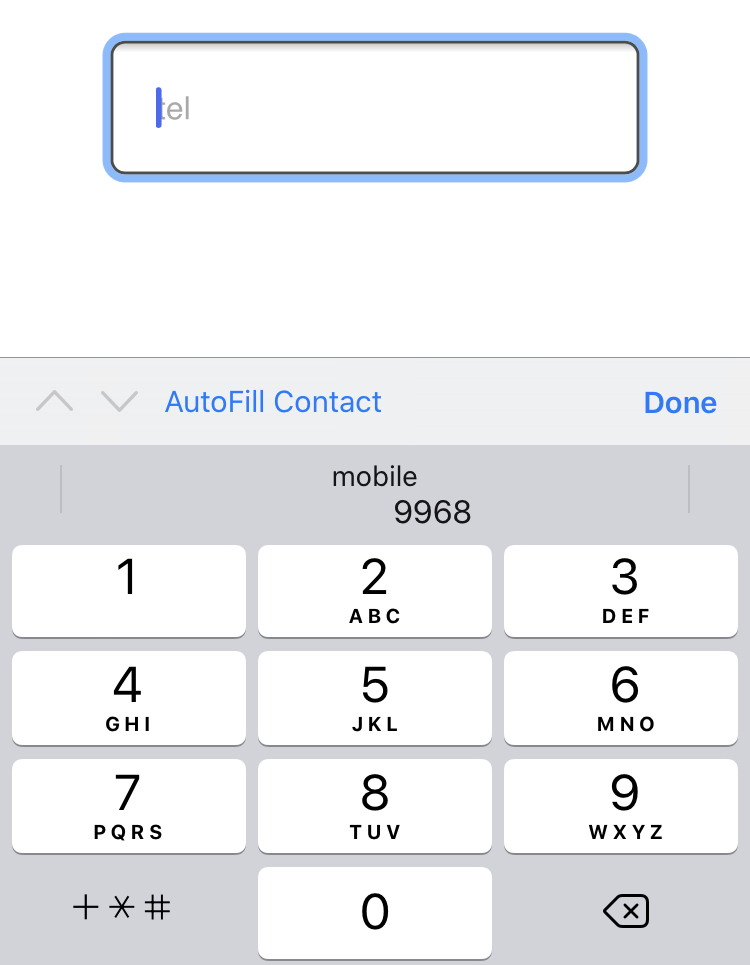
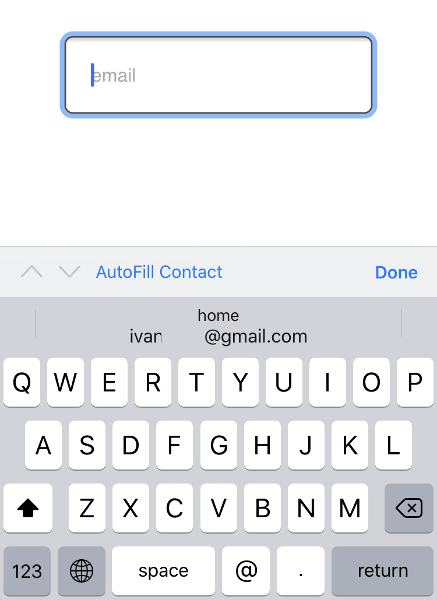

Um dos componentes mais usados/comuns em diversas aplicações Web é o `form` e este pode ser usado
para diversas finalidades sendo a principal capturar informação sobre o utilizador ou uma determinada entidade.

Um formulário pode ser composto por checkboxes, radiobuttons e `input[type="text"]` e outros componentes/elementos
usados para capturar dados com a melhor experiência de utilizador possível.

Dado que a forma em que o formulário se apresenta pode influenciar significativamente a experiência dos utilizadores
é sempre importante escolher o elemento/componente adequado para este feito, tendo em conta acessibilidade e usabilidade.

Antes da criação do atributo `inputmode` para formulários mais especificamente para o elemento `input` não era possível
determinar o comportamento do teclado de um smartphone sendo que esta funcionalidade estava disponível apenas para
aplicações nativas.

Actualmente a realidade é diferente e é possível definir o comportamento de teclado, com isso podemos escolher se o
teclado apresenta somente números, letras, @, números com vírgula e muito mais, usando o atributo `inputmode` com os
valores  *decimal*, *numeric*, *tel*, *search*, *email* e *url*.

### Inputmode decimal

Através do `inputmode="decimal"` podemos instruir o teclado a mostrar somente números, como mostra a imagem e o campo
de texto(somente disponível para smartphones com navegador elegível) abaixo.

```html
<input type="text" inputmode="decimal" placeholder="Decimal"/>
```



<center>
	<input type="text" inputmode="decimal" placeholder="Decimal" class="inputmode" style="padding: 10px; margin: 40px"/>
</center>


### Numeric

Diferentemente do decimal o `inputmode="numeric"` apresenta somente números sem vírgula ou ponto, este pode
ser util para capturar dados como PIN, número de itens a comprar, número de casa e mais outros dados, e comporta-se da
seguinte maneira:

```html
<input type="text" inputmode="numeric" placeholder="numeric"/>
```



<center>
	<input type="text" inputmode="numeric" placeholder="numeric" class="inputmode" style="padding: 10px; margin: 40px"/>
</center>

### Tel

`inputmode="tel"` apresenta algumas semelhanças comparado ao `numeric`, as únicas diferenças são os símbolos
`+*#` que são específicos de números de telefone, o teclado apresenta-se da seguinte maneira:

```html
<input type="text" inputmode="tel" placeholder="tel"/>
```



<center>
	<input type="text" inputmode="tel" placeholder="tel" class="inputmode" style="padding: 10px; margin: 40px"/>
</center>

### Search

`inputmode="search"` altera somente o botão enter/return pelo go/ir, dado que enter/return podem servir para
quebra de linha(dependendo do dispositivo/aplicação e das configurações), o teclado não foge muito da regra dos
teclados disponíveis por padrão.

```html
<input type="text" inputmode="search" placeholder="search"/>
```


<center>
	<input type="text" inputmode="search" placeholder="search" class="inputmode" style="padding: 10px; margin: 40px"/>
</center>

### Email

Através do `inputmode="email"` o teclado inclui @ e dependendo do dispositivo/teclado padrão até domínios de alguns
emails comuns, no IOS13(Safari) o teclado sugere o email do utilizador, e apresenta-se da seguinte maneira:

```html
<input type="text" inputmode="email" placeholder="Email"/>
```



<center>
	<input type="text" inputmode="email" placeholder="Email" class="inputmode" style="padding: 10px; margin: 40px"/>
</center>

### Url

`inputmode="url"` é provavelmente a opção com menos casos de uso porém importante, com ele o teclado adiciona / e .com
(dependendo do dispositivo ou teclado padrão pode até sugerir mais opções).


```html
<input type="text" inputmode="url" placeholder="Url"/>
```


<center>
	<input type="text" inputmode="url" placeholder="Url" class="inputmode" style="padding: 10px; margin: 40px"/>
</center>

O [inputmode](https://html.spec.whatwg.org/multipage/interaction.html#input-modalities:-the-inputmode-attribute) pode
ser usado em textareas e para esconder o teclado com o valor `inputmode="none"`. Apesar de poder melhorar a experiência
do utilizador ao apresentar diferentes modelos/layouts de teclado  o
[`inputmode`](https://developer.mozilla.org/en-US/docs/Web/HTML/Global_attributes/inputmode) ainda tem fraco
[suporte](https://caniuse.com/#feat=input-inputmode) funcionando em alguns navegadores modernos o que pode beneficiar
apenas uma parte dos utilizadores.
