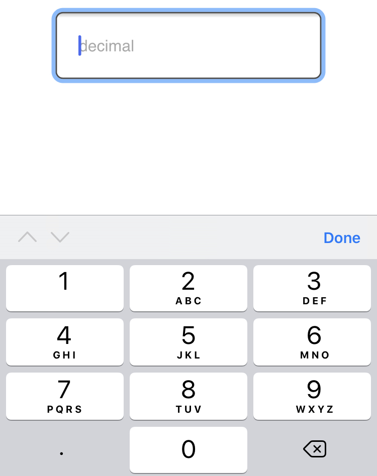
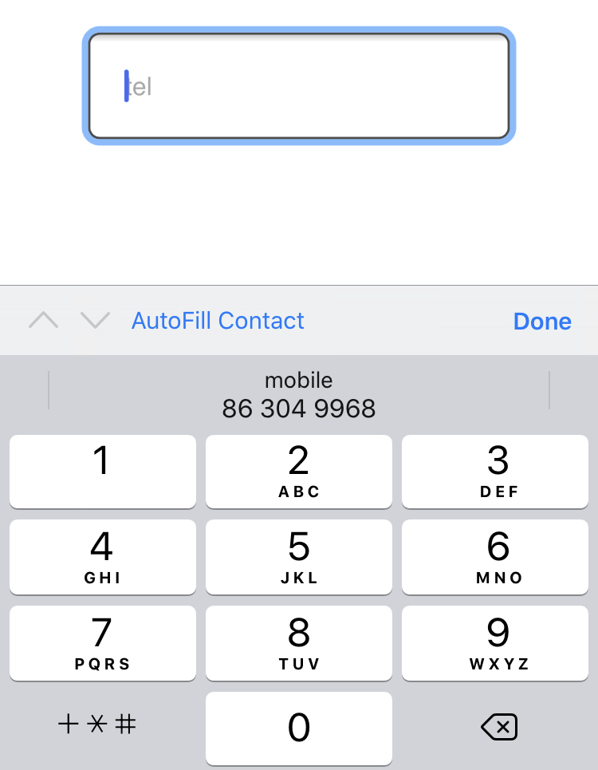
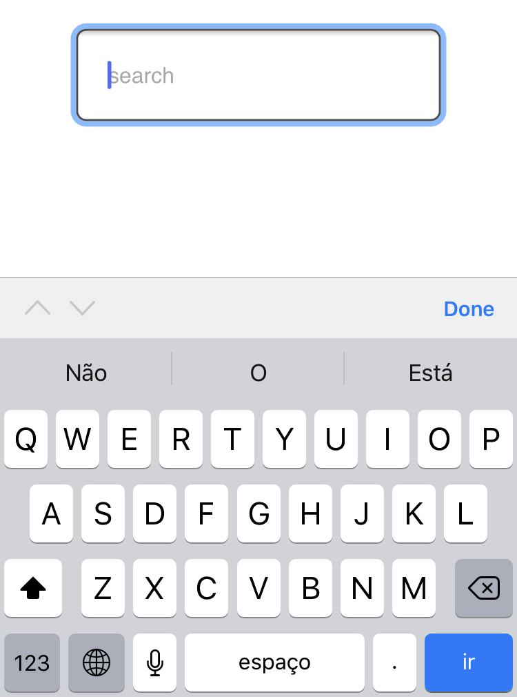
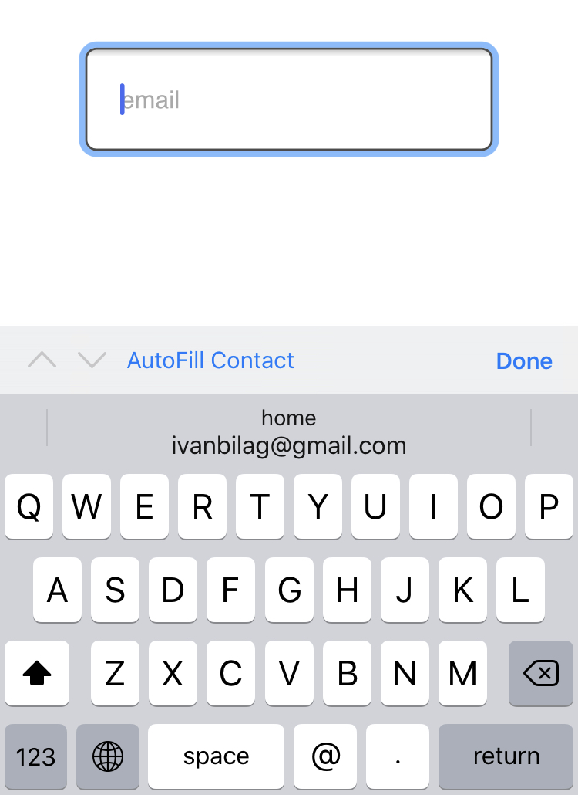
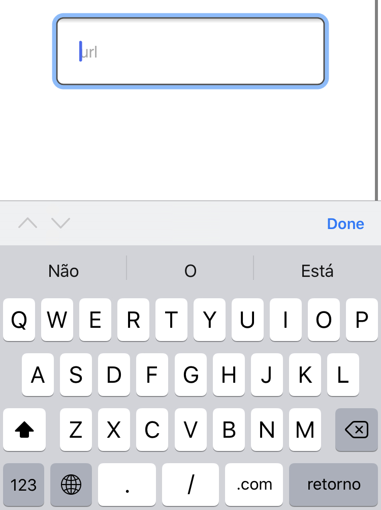

Um dos componentes mais usados/comuns em diversas Aplicações Web é o `form` e este pode ser usado
para diversas finalidades sendo a principal capturar informação sobre o utilizador ou uma determinada entidade.

Um formulário pode ser composto por checkboxes, radiobuttons e `input[type="text"]` e outros components usados
para capturar dados com a melhor experiência de utilizador possível.

Dado que a forma em que o formulário se apresenta pode influenciar significativamente a experiência dos utilizadores
é sempre importante escolher o elemento/componente adequado para este feito tendo em conta acessibilidade e usabilidade.
Antes da criação do atributo `inputmode` para formularios mais especificamente para o elemento input não era possivel
determinar o comportamento do teclado de um smartphone sendo que esta funcionalidade estava disponivel apenas para aplicações
nativas.
Actualmente a realidade é diferente e é possivel definir o comportamento de teclado, com isso podemos escolher se o teclado
apresenta somente numeros, letras, @, numeros com virgula e muito mais usando o attributo `inputmode` com os valores decimal, numeric, tel, search, email e url.

### Inputmode decimal

Atraves do `inputmode="decimal"` podemos instruir o teclado a mostrar somente numeros, como mostra o screenshot e o campo de texto(somente disponivel para smartphones com navegador elegivel) abaixo. 

```html
<input type="text" inputmode="decimal" placeholder="Decimal"/>
```



<center>
	<input type="text" inputmode="decimal" placeholder="Decimal" class="inputmode" style="padding: 10px; margin: 40px"/>
</center>


### Numeric

Diferentemente do decimal o `inputmode="numeric"` apresenta somente numeros sem virgula ou ponto, este pode
ser util para capturar dados como PIN, numero de itens a comprar, numero de casa e mais outros dados, comporta-se da seguinte maneira:

```html
<input type="text" inputmode="numeric" placeholder="Number of seats"/>
```


<center>
	<input type="text" inputmode="numeric" placeholder="Number of seats" class="inputmode" style="padding: 10px; margin: 40px"/>
</center>

### Tel


```html
<input type="text" inputmode="tel" placeholder="Phone number"/>
```



<center>
	<input type="text" inputmode="tel" placeholder="Decimal" class="inputmode" style="padding: 10px; margin: 40px"/>
</center>

### Search

```html
<input type="text" inputmode="search" placeholder="Search Keyword"/>
```



<center>
	<input type="text" inputmode="search" placeholder="Search Keyword" class="inputmode" style="padding: 10px; margin: 40px"/>
</center>

### Email

```html
<input type="text" inputmode="email" placeholder="Email"/>
```



<center>
	<input type="text" inputmode="email" placeholder="Email" class="inputmode" style="padding: 10px; margin: 40px"/>
</center>

### Url

```html
<input type="text" inputmode="url" placeholder="Url"/>
```



<center>
	<input type="text" inputmode="url" placeholder="Url" class="inputmode" style="padding: 10px; margin: 40px"/>
</center>

### Conclusão