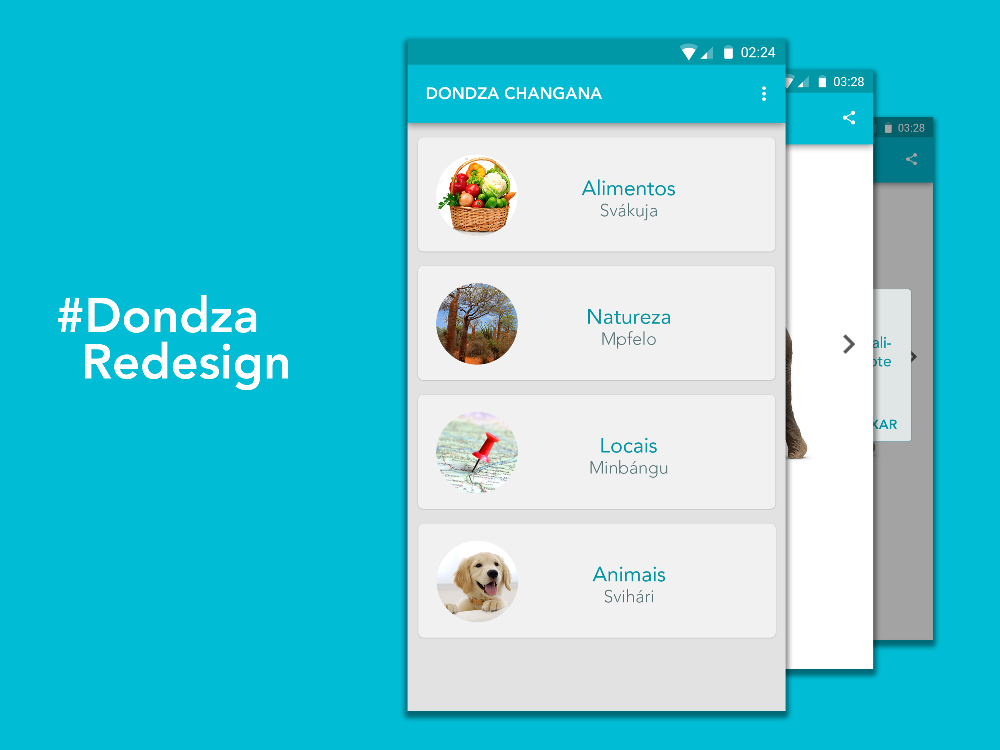
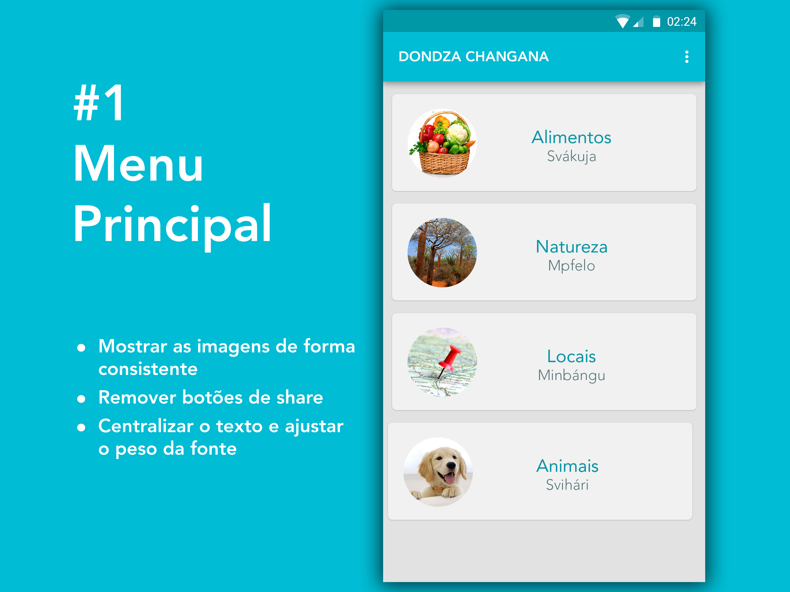
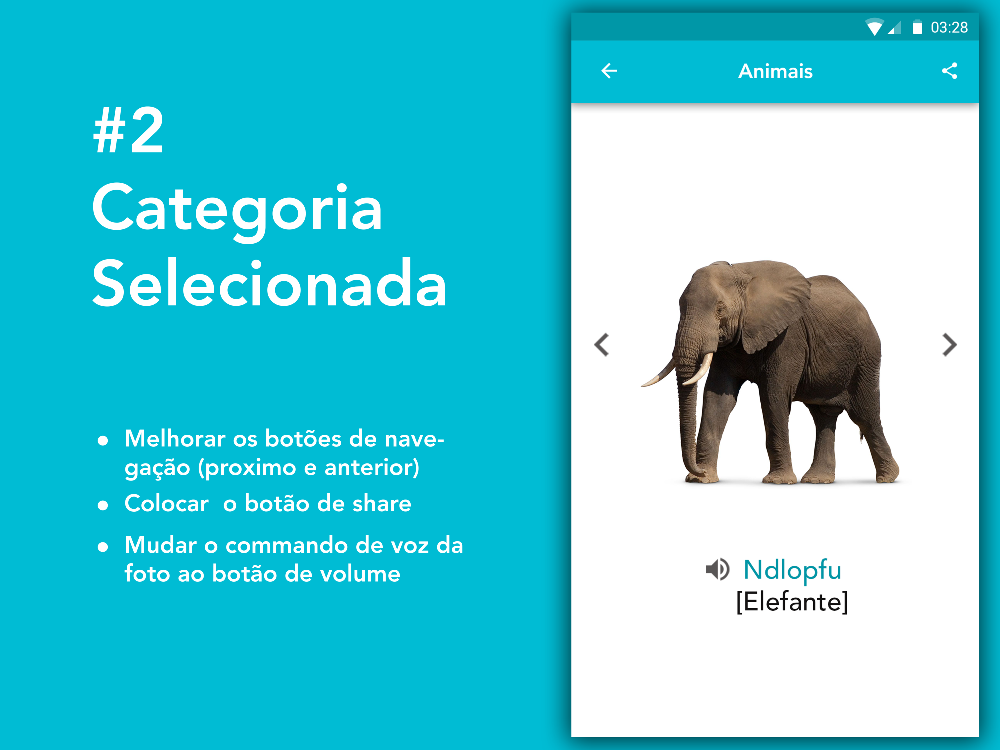
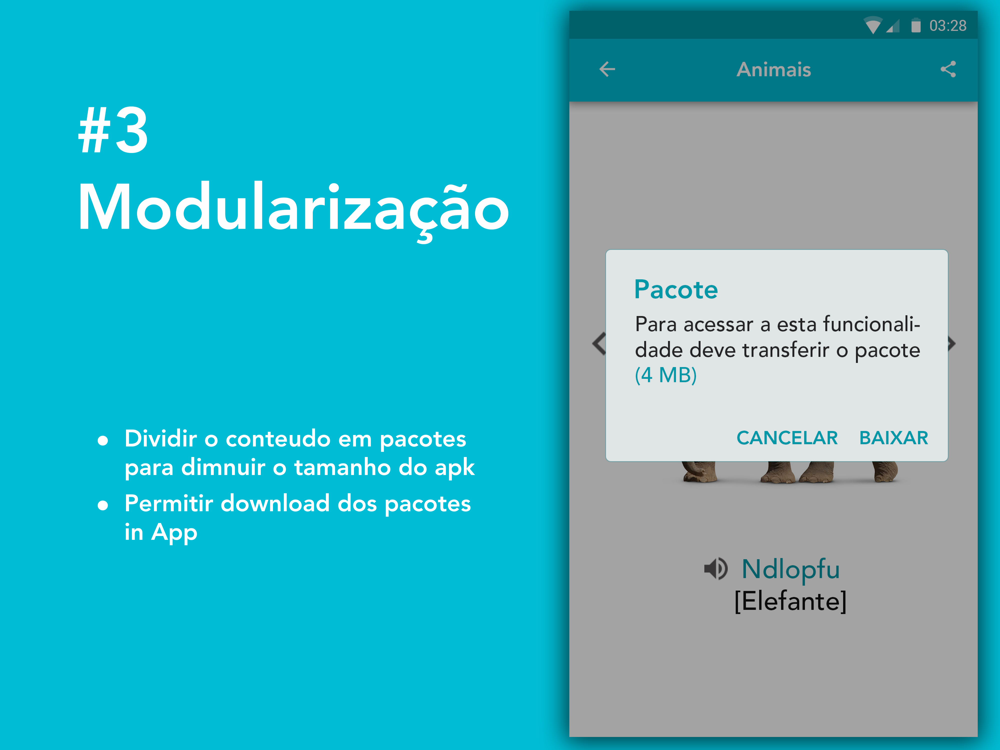
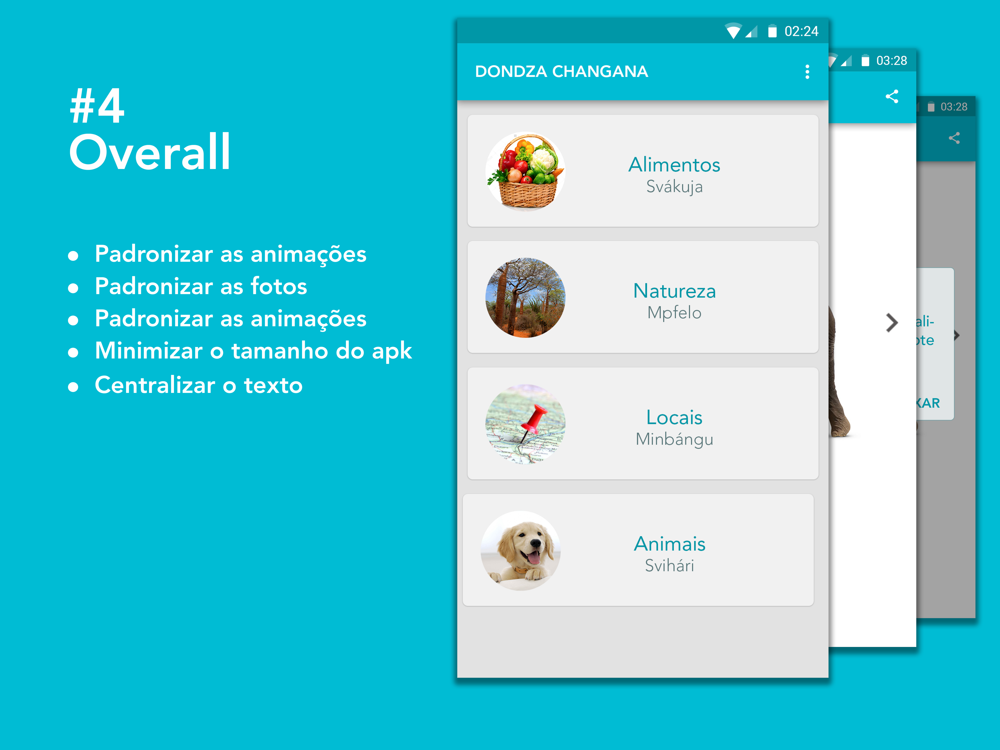

Dondza Changana é um aplicativo que permite aprender algumas palavras em Changana através de imagens ilustrativas, audição da pronúncia das palavras descritas e o significado na língua portuguesa.
Neste artigo vou fazer uma análise da aplicação e a proposição do Redesign.

## Pagina inicial

Uma das coisas que está boa na página inicial do Dondza é a simplicidade, abre logo os serviços da Aplicação, não mostra formulários desnecessários não pede nenhum dado. Neste quesito a equipe do Dondza esta de parabéns. Porque eu penso que:

“Se a sua Aplicação pede os meus dados na primeira tela bem isso só mostra que estás mais preocupado em ter meus dados do que resolver o meu problema”.

Mas existem algumas Excepções a esta regra, mais sobre isso no próximo artigo. A página do Dondza tinha muitas inconsistências, o texto não estava centralizado as imagens eram inconsistentes com a descrição de um campo.
Padronizar todas as imagens é extremamente importante para que a interface e experiência da sua aplicação não sofra.

## Tela das categorias

A parte da categoria seleccionada, por exemplo “animais” não estava apresentável violava as regras do design de aplicações começando pelos botões de navegação que violam o material design “ícones estranhos”, nesta proposta de Redesign os ícones são cinzentos e do material icons e estão no centro da tela assim o utilizador acede a eles facilmente.
Para aceder a versão áudio da palavra o utilizador tinha de clicar na imagem, o que não é intuitivo o ideal seria colocar um botão com ícone de volume na parte de baixo da tela, é preciso fazer com que os botões da sua Aplicação sejam intuitivos que não levem o utilizador a pensar como diz o guru Steve Krug.
Mover o botão de partilha da primeira tela para esta melhoraria a apresentação da sua aplicação.

Animações
As animações de transição estavam mal implementadas, ao clicar no botão de next a aplicação apresentava uma animação de transição que não estava em sintonia com a outra animação ao clicar o botão de back, todas as animações fluem para o mesmo lado o que complica o utilizador.
Seria ideal colocar as animações do next a partir da direita para esquerda e as de back da esquerda.

## Modularidade

Quando crias uma aplicação para Android o tamanho pode ser uma das razões que fazem com que o utilizador não baixe a sua Aplicação, por isso que eu julgo que Aplicações grandes devem ser modulares, neste caso o Dondza devia ser dividido em módulos, isso permite que o utilizador possa baixar a sua Aplicação e que possa fazer as actualizações sem dificuldades porque se a sua Aplicação tem 23 MB como Dondza fica difícil para o utilizador devido à falta de dados para baixar da PlayStore e de memória para instalar um APK de 23 MB right away, mas se o APK tem 5 MB e a App está dividida em 3 módulos ou tem 3 pacotes adicionais que podem ser baixados in App ai o utilizador pode escolher os pacotes que deseja baixar consequentemente poupar memoria e dados.

## Overall

Num overall o que pode melhorar a aplicação: padronizar as animações, usar cartoons/desenhos ou imagens reais, dividir a aplicação em módulos para diminuir o tamanho da aplicação na Store, centralizar o texto na tela inicial e mover os botões de partilha para a categoria seleccionada.

O próximo artigo terá um link para baixar alguns wireframes para que possas usar no desenvolvimento da aplicação.
O que pensas que pode ser melhorado na presente aplicação, qual é a sua opinião sobre o redesign?
Obrigado, por ler o artigo subscreva a publicação para mais artigos de desenvolvimento Android.
