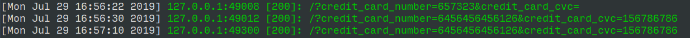

It's getting increasingly likely to have security problems on the frontend due to access to all apis akin to native
applications, and the use of external code through packages such as jquery, react, and vue, the consequences of a
successful breach can be fatal, that can include harm to customers, lost of trust and in some cases legal liabilities

## Use HTTPS

When you use http all data sent from the client to the server and vice-versa is unencrypted that implies that
your users sensitive information such as credit cards number and CVC (if your site supports payment) is exposed
to anyone connected to the network(it gets even more dangerous if the network is public) and sniffing packages
and might get the sensitive data and use it for personal gain at the expense of your users.

Currently there's two options for installing https or getting the ssl certificate, you can either buy from a
vendor/provider such as Digi-cert or get the free ssl certificate with let's encrypt.

The down side of using let's encrypt is browser support, you can only get the Domain Validation ssl
certificate and you have to renew it every three months.

Having https also allows us to access browser apis that would not be available if the domain origin does not
have a valid ssl certificate such as Service workers, Push Api, and Location, you can check the
[full list](https://developer.mozilla.org/en-US/docs/Web/Security/Secure_Contexts/features_restricted_to_secure_contexts)

Not having access to Service workers and other apis means that your app cannot qualify as a PWA, and the worst thing
is that browsers will label your site as being unsecured which can damage your business reputation and SEO.

## Taking user input as is(not sanitizing)

Not sanitizing user input extremely dangerous, if your don't sanitise user input your app might be suggested to SQL or
XSS. Suppose I'm building an app that allows you to share about development meets.

The app contains this input

```html
<input type="text" name="share_input" placeholder="Thought" />
```

If I take the text inputed into that field and append to markup without saniziting the user can fill it with the following:

```javascript
let evilScript = document.body.appendChild(document.createElement("script"))
evilScript.type = "text/javscript"
evilScript.src = "https://cdnjs.cloudflare.com/ajax/libs/vue/2.6.10/vue.esm.js"
```

And the browser will execute the following instructions if the input text is appended using innerHtml method, with that the attack perpetrator
can:

- Request CSS
- Request images
- Make calls to your api
- Control the browser
- Open another page
- Open another tab

It's pretty much game over for you application, the hacker can do as he wishes how he wishes. The best thing to do in
such situation is to escape the text before appending to the DOM, or even better you can use JavaScript's built in
innerText if you want append what's typed as text.

## Don't use deprecated libraries/frameworks with widely know vulnerabilities

Using deprecated libraries with with widely knows vulnerabilities it's almost like asking to be
hacked(seriously don't use jquery 1), hoping that hackers will not find out that your website's
library or framework has known vulnerabilities is not a good strategy. Making a habit of inspecting
the libraries' versions, if you're using github you can turn on notifications for vulnerabilities
in libraries or you can use [https://snyk.io/]() which has a web and cli app that checks vulnerabilities in
all dependencies in project's your `package.json`

## Inspect frameworks or libraries before deploying to production or using it

Sometimes the libraries might not be deprecated or have known vulnerabilities but, it always better to be safe than sorry,
when house builders look for tools to aid them in their work they don't choose the latest fanciest tools that only a
handful of craftsman use, they always in search for tools that stood the test of time, and that's what I think developers
should do, use tools that many developers have tried and did not find any tricky or mal-intentioned code, I also think
that from time to time you should check what code is in your library

## Don't send sensitive data using get requests

One of restful API guides is that we should not mutate data using GET requests, that's a good rule to follow, because
asides making an API restful it can also make it safe. Suppose we have the following form for getting users payment
credit card number and CVC for issuing a payment to a service your application.

```html
<form method="GET">
  <input
    type="number"
    name="credit_card_number"
    placeholder="Credit card number"
  />
  <input type="number" name="credit_card_cvc" placeholder="Credit Card CVC" />
  <button type="submit">pay</button>
</form>
```

Seemingly this form looks okay, but there is a security vulnerability, after submitting a form using a get request the
browser stores the request url and all the input fields containing a name in it will be in the url and hence in
the users browser's history and url bar here is how it looks like:


Accordingly the url will the in users history:


If you have an access log here's what your server log will look like:


Given the vulnerabilities pointed above it's important for us developers to always use post requests for sensitive data,
browsers tend to fallback to get requests if the method is not specified, that means we have to remain vigilant and
add `method="POST"` attribute when dealing with forms that contains sensitive data.

## Add adding noopener noreferer to external links

When we add external links with target="\_blank" attribute the browser allows the opened tab

### Use DOCTYPE and force internet explorer to use it's best rendering engine

When your add `<!DOCTYPE html>` to add html file it let's the browser know that this page is using the latest version
of html, there's nothing new under the sun here, however Internet explorer and Microsoft Edge usually ship with the
engine from previous browsers which also contain errors and security vulnerabilities from previous browsers, one of these
features is CSS in JS

## Don't keep apis keys to javascript code

Unless your API key contains extra protection keeping it in the Javascript code is a mistake and any user who can
access your site will can use your that api key and if it is linked to any special privileges the user can exploit your
application as he wishes.

## Prefer http only cookies for sensitive data

Http only cookies are like the name itself, are only accessible via http, that way evil scripts cannot
read your users sensitive cookies and use them for their own interests.

## Preferably do business logic on the backend

Doing business logic on the frontend is a mistake, because the data on the frontend is subject to
changes and checks

<!--
NOTES:
- TLS SSL
- cve details
- XSS
- owasp top 10
- .env
-->
